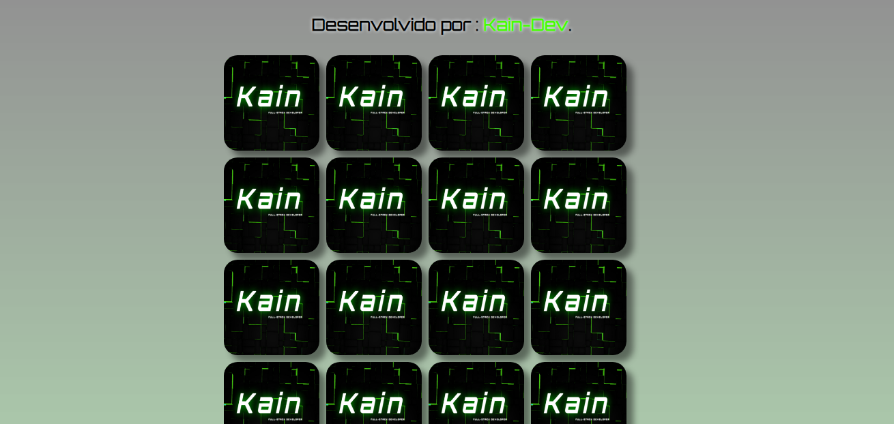
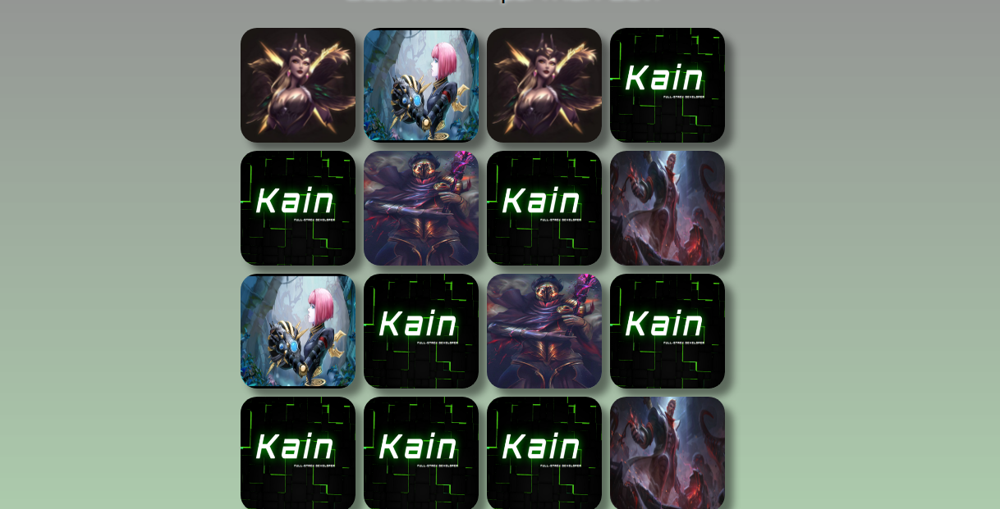
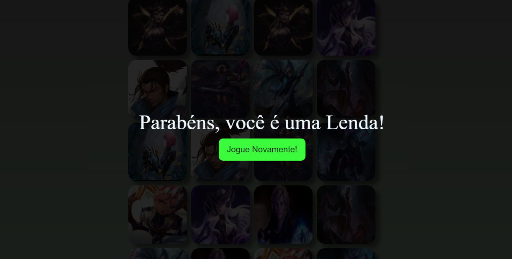

Game-Memory League of Legends  

https://kain-prog.github.io/game-memoryLol/

 
 
 

> Resultado do Game finalizado.

O projeto foi criado em:

- [x] Criação do HTML
- [x] Criação do CSS
- [x] Criação do JavaScript

Resultado: https://kain-prog.github.io/game-memoryLol/

## 🤝 Colaboradores

Pessoa que contribuiu para este projeto:

<table>
  <tr>
    <td align="center">
         
        
          <b>Matheus Santos</b>
        
      </a>
    </td>
   </tr>
</table>
